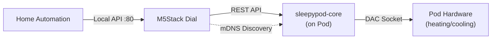

# Sleepypod MT Rotary Dial

An M5Stack Dial (ESP32-S3) temperature controller for [sleepypod-core](https://github.com/throwaway31265/free-sleep), providing a physical rotary interface to control your Eight Sleep Pod's left and right side temperatures.

Based on [RotaryDial by dallonby](https://github.com/dallonby/RotaryDial) — the original FreeSleep rotary dial controller. This project adapts the concept to use sleepypod-core's tRPC/REST APIs, mDNS auto-discovery, and side-name personalization.

## How It Works



The dial communicates with sleepypod-core over your local network — no cloud, no internet required. It discovers the Pod automatically via mDNS (`_sleepypod._tcp`) or uses a manually configured IP.

## Features

### Temperature Control
- **Dual Side Control**: Independent temperature setpoints for left and right sides of the bed
- **Rotary Dial Interface**: 1°F per detent, smooth and responsive
- **Touch Arc Control**: Tap anywhere on the arc to jump to that temperature
- **Temperature Range**: 55°F to 110°F (matching Pod hardware limits)
- **Visual Temperature Arc**: Color gradient from blue (cool) through teal/amber to red (hot)
- **Setpoint Indicators**: Active side shown with radial line, inactive side with subtle tick

### sleepypod-core Integration
- **mDNS Auto-Discovery**: Finds your Pod on the network automatically
- **Personalized Side Names**: Fetches side names from sleepypod-core settings
- **Real-Time Sync**: Polls Pod status every 30 seconds for external changes
- **Debounced Updates**: API calls batched (500ms) to prevent conflicts while adjusting
- **Power Control**: Short tap to toggle side on/off
- **Auto-Restart**: Configurable daily restart for reliability

### Automatic Night Mode
- **Automatic Activation**: Red-only theme between 10pm and 7am (configurable)
- **Reduced Brightness**: 20% during night hours
- **Manual Override**: Medium press (400-1000ms) on center to toggle

### Smart Display
- **Auto Dimming**: ~1% brightness after 10 seconds of inactivity
- **Instant Wake**: Any touch or rotation wakes immediately
- **Double Buffering**: Flicker-free rendering via LGFX_Sprite

### Local REST API
The dial exposes its own API on port 80 for home automation:

| Endpoint | Method | Description |
|----------|--------|-------------|
| `/` | GET | HTML dashboard |
| `/api/temperature` | GET/POST | Current setpoint, set temperature |
| `/api/status` | GET | Full device status |
| `/api/config/pod-ip` | GET/POST | Pod IP configuration |

## Hardware Requirements

- **[M5Stack Dial](https://shop.m5stack.com/products/m5stack-dial-esp32-s3-smart-rotary-knob-w-1-28-round-touch-screen)** — ESP32-S3, 240x240 round capacitive touchscreen, rotary encoder
- **sleepypod-core** running on your Pod's local network

## Setup

### 1. Install PlatformIO

**VS Code (Recommended):**
1. Install [VS Code](https://code.visualstudio.com/)
2. Install the PlatformIO IDE extension
3. Restart VS Code

**CLI:**
```bash
pip install platformio
# or
brew install platformio
```

### 2. Clone & Configure

```bash
git clone https://github.com/your-org/sleepypod-mt-rotary-dial.git
cd sleepypod-mt-rotary-dial

# Set your WiFi credentials
cp include/credentials.h.example include/credentials.h
# Edit include/credentials.h with your SSID and password
```

### 3. Configure Timezone (Optional)

Edit `include/config.h`:

```c
#define GMT_OFFSET_SEC -28800     // PST (UTC-8)
#define DAYLIGHT_OFFSET_SEC 0     // Set to 3600 for DST
```

| Timezone | Offset |
|----------|--------|
| EST (US Eastern) | `-18000` |
| CST (US Central) | `-21600` |
| PST (US Pacific) | `-28800` |
| GMT/UTC | `0` |
| CET (Central Europe) | `3600` |

### 4. Build & Flash

```bash
pio run --target upload
```

### 5. Configure Pod Connection

On first boot, the dial will:
1. Connect to WiFi
2. Attempt mDNS auto-discovery of your Pod
3. Fall back to the saved/default IP (192.168.1.88)

To manually set the Pod IP:
- Open Settings (long press center or tap bottom area)
- Navigate to "Pod IP Address"
- Use the rotary dial to set each octet

## Usage

### Main Screen

```
        ┌─────────────────┐
       ╱   Temperature    ╲
      │     Arc (210°)      │
      │                     │
      │      ┌─────┐       │
      │      │ 75°F│       │
      │      └─────┘       │
      │                     │
      │   [L]         [R]   │
       ╲    12:34:56     ╱
        └─────────────────┘
```

### Controls

| Action | Result |
|--------|--------|
| **Rotate dial** | Adjust temperature (1°F per click) |
| **Double-press dial** | Reset to default (75°F) |
| **Tap temperature arc** | Jump to that temperature |
| **Short tap center** (<400ms) | Toggle power ON/OFF |
| **Double-tap center** | Reset to default temperature |
| **Medium hold center** (400ms-1s) | Toggle night mode |
| **Long hold center** (>1s) | Open settings menu |
| **Tap L button** | Switch to left side |
| **Tap R button** | Switch to right side |
| **Tap bottom area** | Open settings menu |

### Settings Menu

| Setting | Description |
|---------|-------------|
| **WiFi Settings** | Scan and connect to WiFi |
| **Pod IP Address** | Set Pod IP manually |
| **Discover Pod** | Re-run mDNS discovery |
| **Temperature Unit** | Toggle °F / °C display |
| **Night Mode** | Toggle manual override |
| **Active Side** | Switch default side (Left/Right) |

## Architecture

See [docs/architecture.md](docs/architecture.md) for detailed system diagrams including boot sequence, main loop flow, API integration, and state management.

## Configuration Reference

| Setting | Default | Description |
|---------|---------|-------------|
| `TEMP_MIN_F` | 55 | Minimum temperature (°F) |
| `TEMP_MAX_F` | 110 | Maximum temperature (°F) |
| `TEMP_DEFAULT_F` | 75 | Default/reset temperature (°F) |
| `POD_API_PORT` | 3000 | sleepypod-core API port |
| `API_PORT` | 80 | Local HTTP API port |
| `BRIGHTNESS_DAY` | 255 | Day brightness (0-255) |
| `BRIGHTNESS_NIGHT` | 51 | Night brightness (~20%) |
| `BRIGHTNESS_DIM` | 2 | Idle brightness (~1%) |
| `DIM_TIMEOUT_MS` | 10000 | Idle timeout before dimming |
| `NIGHT_START_HOUR` | 22 | Night mode start (24h) |
| `NIGHT_END_HOUR` | 7 | Night mode end (24h) |

## Troubleshooting

### Pod not found via mDNS
- Ensure sleepypod-core is running on the Pod
- Verify both devices are on the same subnet
- Try manual IP configuration via Settings > Pod IP Address
- The Pod advertises `_sleepypod._tcp` on port 3000

### Temperature not syncing
- Check serial monitor for API error messages
- Verify Pod IP is correct (Settings > Pod IP Address)
- Ensure sleepypod-core is accessible on port 3000
- The dial syncs every 30 seconds — restart to force immediate sync

### Display issues
- Night mode activates automatically 10pm-7am; check timezone in `config.h`
- If stuck dimmed, touch or rotate to wake

## Acknowledgments

- **[dallonby/RotaryDial](https://github.com/dallonby/RotaryDial)** — Original FreeSleep rotary dial controller. This project is built on their excellent work adapting the M5Stack Dial for bed temperature control.
- **[free-sleep](https://github.com/throwaway31265/free-sleep)** — Open source Eight Sleep Pod control
- **[M5Stack](https://m5stack.com/)** — M5Stack Dial hardware
- **[PlatformIO](https://platformio.org/)** — Build system

## License

MIT License — See LICENSE file for details.
