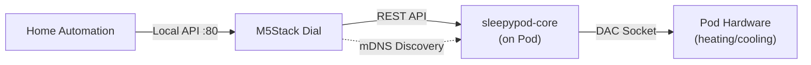

# Sleepypod MT Rotary Dial

[](https://codecov.io/gh/sleepypod/m5-rotary-dial)

An M5Stack Dial (ESP32-S3) temperature controller for [sleepypod-core](https://github.com/throwaway31265/free-sleep), providing a physical rotary interface to control your Eight Sleep Pod's left and right side temperatures.

Based on [RotaryDial by dallonby](https://github.com/dallonby/RotaryDial) — the original FreeSleep rotary dial controller. This project adapts the concept to use sleepypod-core's tRPC/REST APIs, mDNS auto-discovery, and side-name personalization.

## How It Works


```mermaid
graph LR
    Dial["M5Stack Dial"] -- "REST API" --> Pod["sleepypod-core<br/>(on Pod)"]
    Pod -- "DAC Socket" --> HW["Pod Hardware<br/>(heating/cooling)"]
    Dial -. "mDNS Discovery" .-> Pod
    HA["Home Automation"] -- "Local API :80" --> Dial
```

The dial communicates with sleepypod-core over your local network — no cloud, no internet required. It discovers the Pod automatically via mDNS (`_sleepypod._tcp`) or uses a manually configured IP.

## Features

### Temperature Control
- **Your side is a preference**: Settings > Side picks Left or Right and sticks; nothing on the main screen switches it by accident
- **Rotary Dial Interface**: 1°F per detent, 2°F per detent when you spin it, never more
- **Power**: Click the dial or tap the power glyph. Two detents below 55°F also turn the side off; any detent up turns it back on
- **Temperature Range**: 55°F to 110°F (matching Pod hardware limits)
- **Visual Temperature Arc**: 270° gradient from cold-water blue through a body-neutral white to red-orange
- **One timeline**: Solid fill is the mattress temperature; the hashed, slowly marching span is the distance still to travel to the target, like a loader

### sleepypod-core Integration
- **mDNS Auto-Discovery**: Finds your Pod on the network automatically
- **Personalized Side Names**: Fetches side names from sleepypod-core settings
- **Real-Time Sync**: Polls Pod status every 30 seconds for external changes (backs off when the Pod is unreachable)
- **Debounced, non-blocking updates**: Changes are sent 500ms after the dial stops, from a worker task, so a slow Pod never stalls the dial
- **Unconfirmed writes are visible**: The arc's end cap is hollow until the Pod acknowledges a change
- **Local changes win**: Pod sync never overwrites a setpoint touched in the last 30 seconds
- **Connection Status**: "No Wi-Fi" / "Pod offline" on the main screen when degraded
- **Auto-Reconnect**: Recovers WiFi automatically after router restarts
- **Auto-Restart**: Configurable daily restart for reliability

### Automatic Night Mode
- **Automatic Activation**: Red-only theme between 10pm and 7am (configurable)
- **Reduced Brightness**: 20% during night hours
- **Manual Override**: Settings offers Auto / Forced On / Forced Off
- **Silent at night**: No sounds at all while the night theme is active; day-time feedback is a single 10ms tick

### Smart Display
- **Auto Dimming**: ~1% brightness after 10 seconds of inactivity (5 seconds at night), with fades instead of steps
- **Glanceable when dim**: Only the big numeral and one status dot survive at 1% backlight, by design
- **Safe Wake**: Input more than 3 seconds after dimming only wakes the screen — it never changes anything
- **Motion**: The arc settles after you stop turning, the side underline slides, nothing else animates

### Local REST API
The dial exposes its own API on port 80 for home automation:

| Endpoint | Method | Description |
|----------|--------|-------------|
| `/` | GET | HTML dashboard |
| `/api/temperature` | GET/POST | Current setpoint, set temperature |
| `/api/status` | GET | Full device status |
| `/api/config/pod-ip` | GET/POST | Pod IP configuration |

## Screens

Captured from the device with `tools/dial_shot.py`.

| Heating | Cooling | At target | Off |
|---|---|---|---|
|  |  |  |  |

| Hold for settings | Settings | Night | Dim (night / day) |
|---|---|---|---|
|  |  |  |   |

## Hardware Requirements

- **[M5Stack Dial](https://shop.m5stack.com/products/m5stack-dial-esp32-s3-smart-rotary-knob-w-1-28-round-touch-screen)** — ESP32-S3, 240x240 round capacitive touchscreen, rotary encoder
- **sleepypod-core** running on your Pod's local network

## Setup

### 1. Install PlatformIO

**VS Code (Recommended):**
1. Install [VS Code](https://code.visualstudio.com/)
2. Install the PlatformIO IDE extension
3. Restart VS Code

**CLI:**
```bash
pip install platformio
# or
brew install platformio
```

### 2. Clone & Configure

```bash
git clone https://github.com/your-org/sleepypod-mt-rotary-dial.git
cd sleepypod-mt-rotary-dial

# Set your WiFi credentials
cp include/credentials.h.example include/credentials.h
# Edit include/credentials.h with your SSID and password
```

### 3. Configure Timezone (Optional)

Edit `include/config.h`:

```c
#define GMT_OFFSET_SEC -28800     // PST (UTC-8)
#define DAYLIGHT_OFFSET_SEC 0     // Set to 3600 for DST
```

| Timezone | Offset |
|----------|--------|
| EST (US Eastern) | `-18000` |
| CST (US Central) | `-21600` |
| PST (US Pacific) | `-28800` |
| GMT/UTC | `0` |
| CET (Central Europe) | `3600` |

### 4. Build & Flash

```bash
pio run --target upload
```

### 5. Configure Pod Connection

On first boot, the dial will:
1. Connect to WiFi
2. Attempt mDNS auto-discovery of your Pod
3. Fall back to the saved/default IP (192.168.1.88)

To manually set the Pod IP:
- Open Settings (long press center or tap bottom area)
- Navigate to "Pod IP Address"
- Use the rotary dial to set each octet

## Usage

### Main Screen

```
        ┌───────────────────┐
       ╱   Jon  ·  Heidi     ╲      ← side pair, underline marks the active side
      │   ‾‾‾                 │
      │        82 °F          │      ← setpoint (DejaVu 56)
      │                       │
      │     heating · 69      │      ← mattress temperature and direction
       ╲                     ╱
        ╲  ⏻    12:26    ⚙ ╱        ← power and settings glyphs flank the clock
         └─────────────────┘
```

The 270° arc opens at the bottom and is one temperature timeline: solid
fill up to the mattress temperature, then a hashed span that marches slowly
toward the target and shrinks as the bed converges. The cap sits at the
target. When Wi-Fi is down the clock
is replaced by "No Wi-Fi" and the arc turns grey; when the Pod is
unreachable the status line says "Pod offline" and the arc's end cap is
drawn hollow, the same cue used while a change is still unacknowledged.

### Controls

Nothing on the main screen changes a value by touch. The only touch targets
are the power and gear glyphs beside the clock; the hold shows a progress ring.

| Action | Result |
|--------|--------|
| **Rotate** | Adjust the active side's setpoint (1°F per detent; 2°F when spun) |
| **Click the dial** or **tap the power glyph** | Toggle the side's power |
| **Rotate 2 detents below 55°F** | Also turns the side off (the OFF stop); any detent up turns it back on |
| **Hold the dial or screen 1.5s** or **tap the gear** | Open settings; a ring fills around the rim, release early to cancel |
| **Settings > Side** | Choose Left or Right; it switches immediately and is remembered |
| **Any input while dimmed** | Wakes the screen only (after the 3-second safe-wake arming) |

### Settings Menu

| Setting | Description |
|---------|-------------|
| **WiFi Settings** | Scan and connect to WiFi (select DEL in the character carousel to backspace; hold the dial button to connect) |
| **Pod IP Address** | Set Pod IP manually (tap to save at any octet) |
| **Discover Pod** | Re-run mDNS discovery |
| **Temperature Unit** | Toggle °F / °C display (a local choice sticks — Pod sync won't revert it) |
| **Night Mode** | Cycle Auto / Forced On / Forced Off |
| **Side** | Which side this dial controls (switches immediately, remembered) |

## Architecture

See [docs/architecture.md](docs/architecture.md) for detailed system diagrams including boot sequence, main loop flow, API integration, and state management.

## Configuration Reference

| Setting | Default | Description |
|---------|---------|-------------|
| `TEMP_MIN_F` | 55 | Minimum temperature (°F) |
| `TEMP_MAX_F` | 110 | Maximum temperature (°F) |
| `TEMP_DEFAULT_F` | 75 | Default/reset temperature (°F) |
| `POD_API_PORT` | 3000 | sleepypod-core API port |
| `API_PORT` | 80 | Local HTTP API port |
| `BRIGHTNESS_DAY` | 255 | Day brightness (0-255) |
| `BRIGHTNESS_NIGHT` | 51 | Night brightness (~20%) |
| `BRIGHTNESS_DIM` | 2 | Idle brightness (~1%) |
| `DIM_TIMEOUT_MS` | 10000 | Idle timeout before dimming |
| `NIGHT_START_HOUR` | 22 | Night mode start (24h) |
| `NIGHT_END_HOUR` | 7 | Night mode end (24h) |

## Troubleshooting

### Pod not found via mDNS
- Ensure sleepypod-core is running on the Pod
- Verify both devices are on the same subnet
- Try manual IP configuration via Settings > Pod IP Address
- The Pod advertises `_sleepypod._tcp` on port 3000

### Temperature not syncing
- Check serial monitor for API error messages
- Verify Pod IP is correct (Settings > Pod IP Address)
- Ensure sleepypod-core is accessible on port 3000
- The dial syncs every 30 seconds — restart to force immediate sync

### Display issues
- Night mode activates automatically 10pm-7am; check timezone in `config.h`
- If stuck dimmed, touch or rotate to wake

## Acknowledgments

- **[dallonby/RotaryDial](https://github.com/dallonby/RotaryDial)** — Original FreeSleep rotary dial controller. This project is built on their excellent work adapting the M5Stack Dial for bed temperature control.
- **[free-sleep](https://github.com/throwaway31265/free-sleep)** — Open source Eight Sleep Pod control
- **[M5Stack](https://m5stack.com/)** — M5Stack Dial hardware
- **[PlatformIO](https://platformio.org/)** — Build system

## License

MIT License — See LICENSE file for details.
