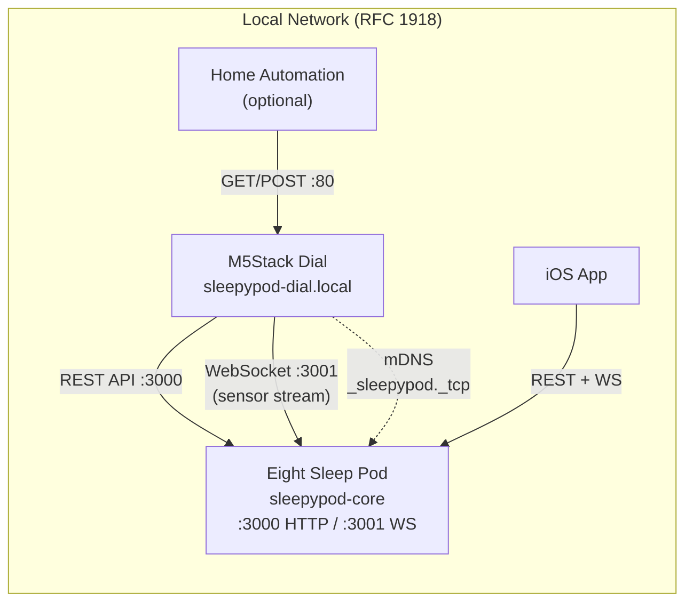
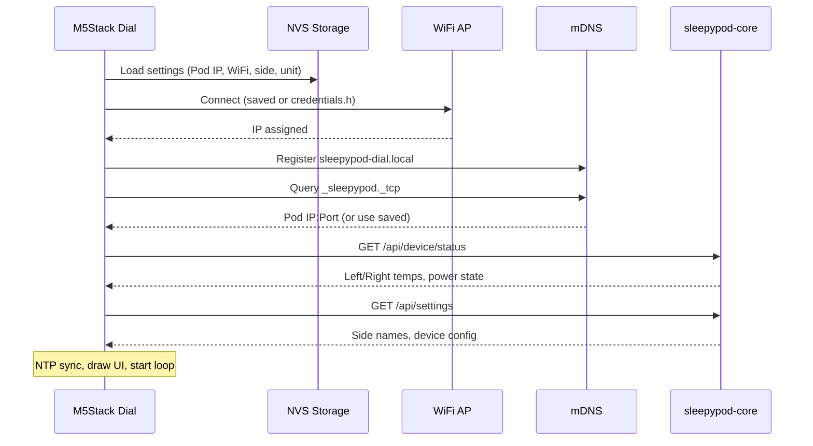
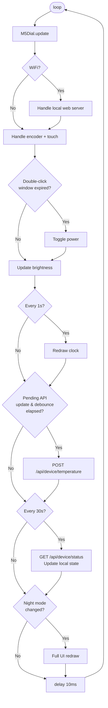
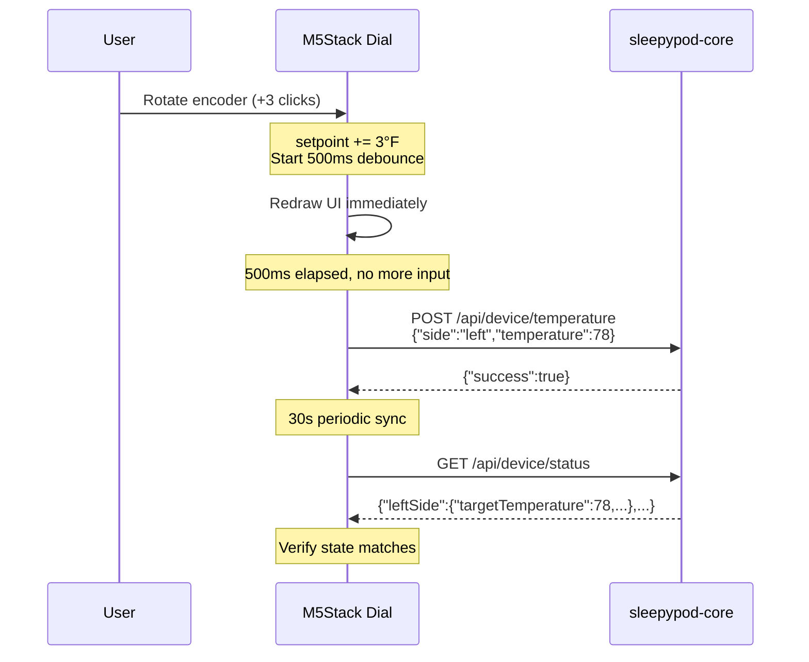
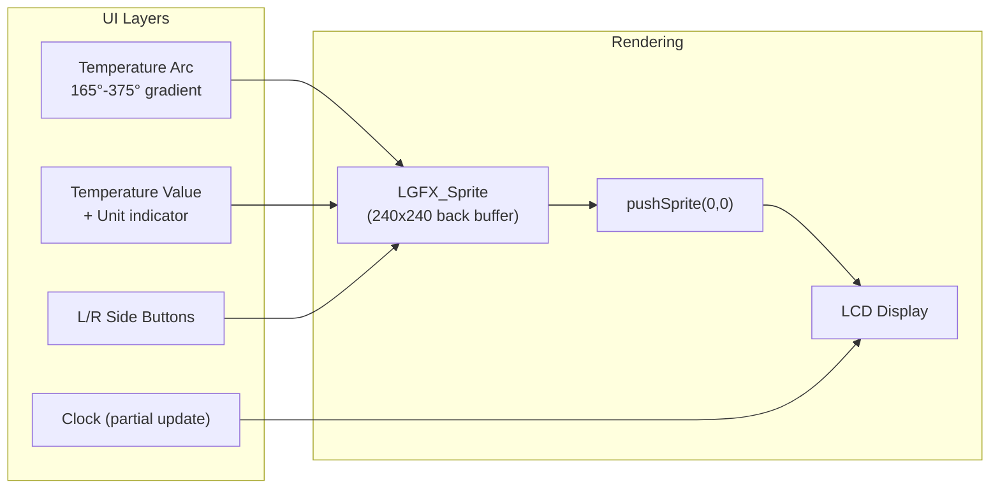
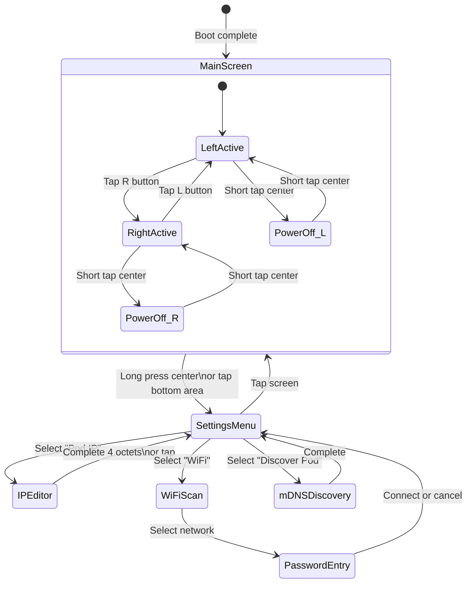

# Architecture

## System Overview

The Sleepypod MT Rotary Dial is an M5Stack Dial (ESP32-S3) firmware that controls an Eight Sleep Pod via [sleepypod-core](https://github.com/your-org/sleepypod-core) APIs over the local network. It provides a physical rotary interface for temperature control, side switching, and power management.

> Based on [RotaryDial by dallonby](https://github.com/dallonby/RotaryDial), adapted from FreeSleep to sleepypod-core APIs.

## Network Topology



## Boot Sequence



## Main Loop



## API Integration

### sleepypod-core Endpoints Used

| Endpoint | Method | Purpose |
|----------|--------|---------|
| `/api/device/status` | GET | Fetch current temperature and power state for both sides |
| `/api/device/temperature` | POST | Set target temperature (55-110°F) for a side |
| `/api/device/power` | POST | Turn a side on/off |
| `/api/settings` | GET | Fetch side names, device timezone, temp unit |

### Request/Response Flow



### Local API (Exposed by Dial)

The dial exposes its own REST API on port 80 for home automation integration:

| Endpoint | Method | Description |
|----------|--------|-------------|
| `/` | GET | HTML dashboard |
| `/api/temperature` | GET | Current setpoint and side info |
| `/api/temperature` | POST | Set temperature (`{"setpoint":75,"side":"left"}`) |
| `/api/status` | GET | Full status (Pod IP, both sides, unit) |
| `/api/config/pod-ip` | GET/POST | Get/set Pod IP address |

## Display Architecture



All rendering uses double-buffering via LGFX_Sprite to eliminate flicker. The clock uses a dedicated mini-sprite for efficient per-second updates without full redraws.

## State Management



## Temperature Flow

```
                    ┌──────────────────────────────────────┐
                    │         Internal: Fahrenheit (int)    │
                    │         Range: 55 - 110°F             │
                    │         Step: 1°F per encoder detent   │
                    └────────────┬─────────────────────────┘
                                 │
            ┌────────────────────┼────────────────────┐
            ▼                    ▼                    ▼
    ┌───────────────┐  ┌─────────────────┐  ┌──────────────┐
    │  Display (°F)  │  │  Display (°C)    │  │  API Call     │
    │  "75"          │  │  "23.9"          │  │  temp: 75     │
    │  (raw int)     │  │  (F→C convert)   │  │  (raw int)    │
    └───────────────┘  └─────────────────┘  └──────────────┘
```

## NVS Storage Map

| Key | Type | Default | Description |
|-----|------|---------|-------------|
| `podIP0`-`podIP3` | uint8 | 192.168.1.88 | Pod IP address octets |
| `podPort` | uint16 | 3000 | Pod API port |
| `wifiSSID` | string | "" | Saved WiFi SSID |
| `wifiPass` | string | "" | Saved WiFi password |
| `useFahrenheit` | bool | true | Temperature display unit |
| `rightSide` | bool | false | Default active side |
| `leftName` | string | "Left" | Left side display name |
| `rightName` | string | "Right" | Right side display name |
