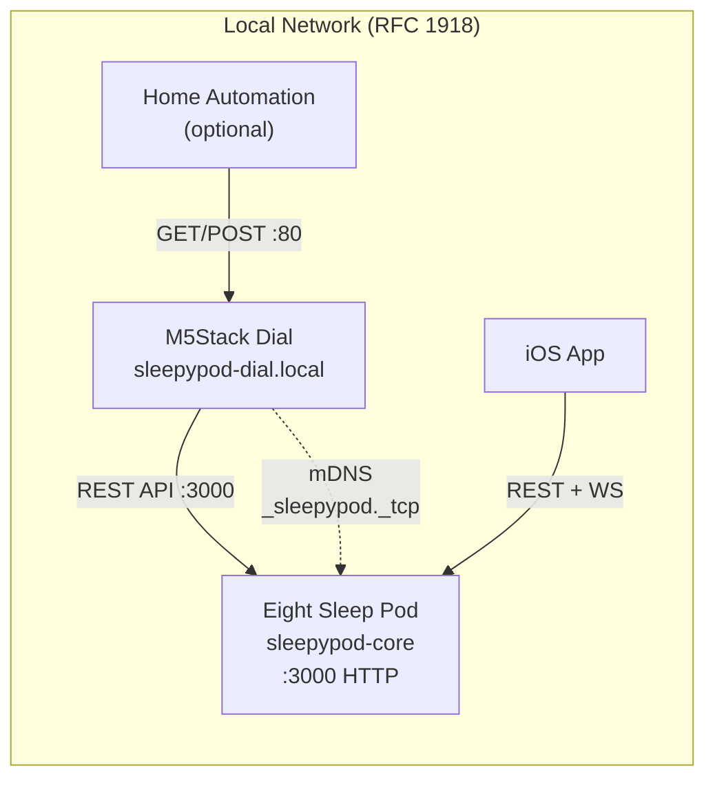
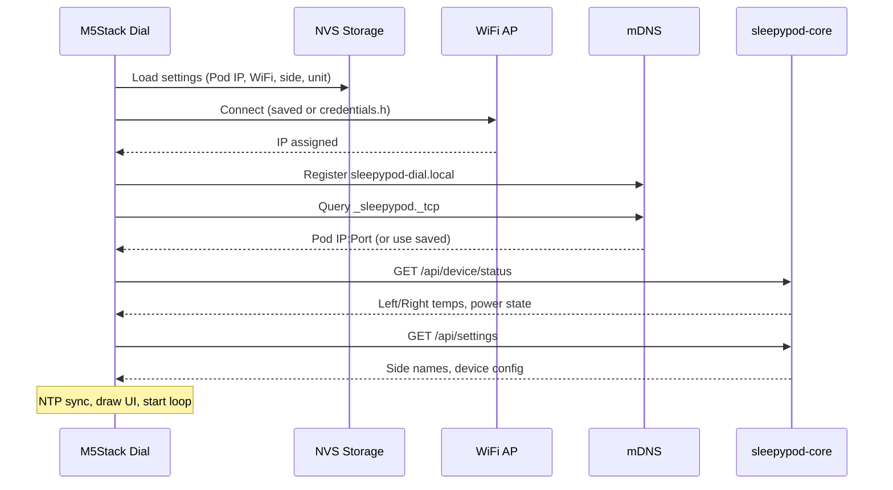
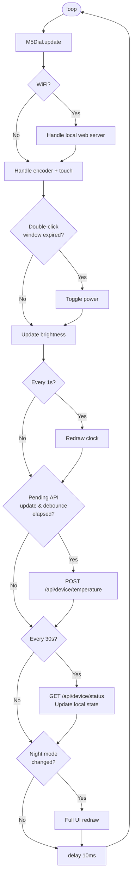
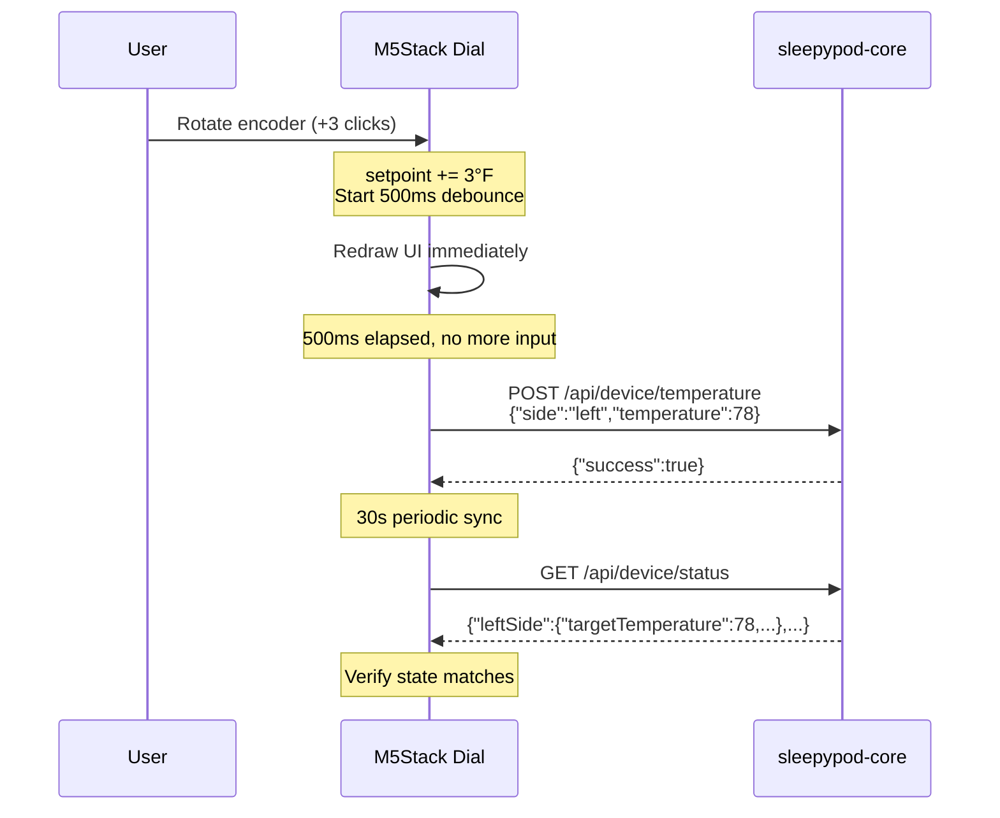
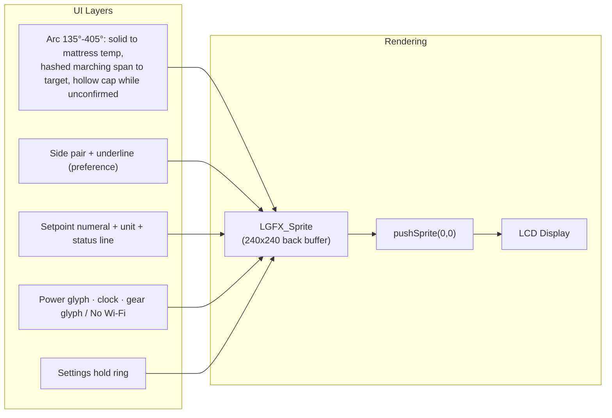
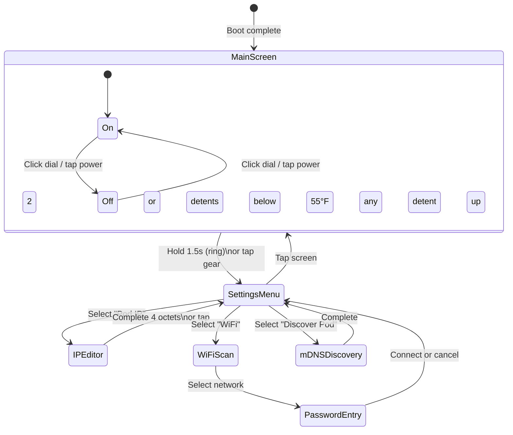

# Architecture

## System Overview

The Sleepypod MT Rotary Dial is an M5Stack Dial (ESP32-S3) firmware that controls an Eight Sleep Pod via [sleepypod-core](https://github.com/your-org/sleepypod-core) APIs over the local network. It provides a physical rotary interface for temperature control, side switching, and power management.

> Based on [RotaryDial by dallonby](https://github.com/dallonby/RotaryDial), adapted from FreeSleep to sleepypod-core APIs.

## Network Topology


```mermaid
graph LR
    subgraph LAN["Local Network (RFC 1918)"]
        Dial["M5Stack Dial<br/>sleepypod-dial.local"]
        Pod["Eight Sleep Pod<br/>sleepypod-core<br/>:3000 HTTP"]
        Phone["iOS App"]
        HA["Home Automation<br/>(optional)"]
    end

    Dial -- "REST API :3000" --> Pod
    Phone -- "REST + WS" --> Pod
    HA -- "GET/POST :80" --> Dial

    Dial -. "mDNS<br/>_sleepypod._tcp" .-> Pod
```

## Boot Sequence


```mermaid
sequenceDiagram
    participant D as M5Stack Dial
    participant NVS as NVS Storage
    participant WiFi as WiFi AP
    participant mDNS as mDNS
    participant Pod as sleepypod-core

    D->>NVS: Load settings (Pod IP, WiFi, side, unit)
    D->>WiFi: Connect (saved or credentials.h)
    WiFi-->>D: IP assigned

    D->>mDNS: Register sleepypod-dial.local
    D->>mDNS: Query _sleepypod._tcp
    mDNS-->>D: Pod IP:Port (or use saved)

    D->>Pod: GET /api/device/status
    Pod-->>D: Left/Right temps, power state

    D->>Pod: GET /api/settings
    Pod-->>D: Side names, device config

    Note over D: NTP sync, draw UI, start loop
```

## Main Loop


```mermaid
flowchart TD
    Start([loop]) --> Update[M5Dial.update]
    Update --> Web{WiFi?}
    Web -->|Yes| HandleHTTP[Handle local web server]
    Web -->|No| Input

    HandleHTTP --> Input[Handle encoder + touch]
    Input --> DblClick{Double-click<br/>window expired?}
    DblClick -->|Yes| TogglePower[Toggle power]
    DblClick -->|No| Brightness

    TogglePower --> Brightness[Update brightness]
    Brightness --> Clock{Every 1s?}
    Clock -->|Yes| UpdateClock[Redraw clock]
    Clock -->|No| Debounce

    UpdateClock --> Debounce{Pending API<br/>update & debounce<br/>elapsed?}
    Debounce -->|Yes| SendTemp["POST /api/device/temperature"]
    Debounce -->|No| Sync

    SendTemp --> Sync{Every 30s?}
    Sync -->|Yes| FetchStatus["GET /api/device/status<br/>Update local state"]
    Sync -->|No| Night

    FetchStatus --> Night{Night mode<br/>changed?}
    Night -->|Yes| Redraw[Full UI redraw]
    Night -->|No| Delay[delay 10ms]

    Redraw --> Delay
    Delay --> Start
```

## API Integration

### sleepypod-core Endpoints Used

| Endpoint | Method | Purpose |
|----------|--------|---------|
| `/api/device/status` | GET | Fetch current temperature and power state for both sides |
| `/api/device/temperature` | POST | Set target temperature (55-110°F) for a side |
| `/api/device/power` | POST | Turn a side on/off |
| `/api/settings` | GET | Fetch side names, device timezone, temp unit |

### Request/Response Flow


```mermaid
sequenceDiagram
    participant User
    participant Dial as M5Stack Dial
    participant Pod as sleepypod-core

    User->>Dial: Rotate encoder (+3 clicks)
    Note over Dial: setpoint += 3°F<br/>Start 500ms debounce
    Dial->>Dial: Redraw UI immediately

    Note over Dial: 500ms elapsed, no more input
    Dial->>Pod: POST /api/device/temperature<br/>{"side":"left","temperature":78}
    Pod-->>Dial: {"success":true}

    Note over Dial: 30s periodic sync
    Dial->>Pod: GET /api/device/status
    Pod-->>Dial: {"leftSide":{"targetTemperature":78,...},...}
    Note over Dial: Verify state matches
```

### Local API (Exposed by Dial)

The dial exposes its own REST API on port 80 for home automation integration:

| Endpoint | Method | Description |
|----------|--------|-------------|
| `/` | GET | HTML dashboard |
| `/api/temperature` | GET | Current setpoint and side info |
| `/api/temperature` | POST | Set temperature (`{"setpoint":75,"side":"left"}`) |
| `/api/status` | GET | Full status (Pod IP, both sides, unit) |
| `/api/config/pod-ip` | GET/POST | Get/set Pod IP address |

## Display Architecture


```mermaid
flowchart LR
    subgraph Rendering
        Sprite["LGFX_Sprite<br/>(240x240 back buffer)"] --> Push["pushSprite(0,0)"]
        Push --> LCD["LCD Display"]
    end

    subgraph "UI Layers"
        Arc["Arc 135°-405°: solid to mattress temp,<br/>hashed marching span to target, hollow cap while unconfirmed"] --> Sprite
        Sides["Side pair + underline (preference)"] --> Sprite
        Center["Setpoint numeral + unit + status line"] --> Sprite
        Clock["Power glyph · clock · gear glyph / No Wi-Fi"] --> Sprite
        Ring["Settings hold ring"] --> Sprite
    end
```

The encoder is polled by a 1ms FreeRTOS task (its GPIOs have no interrupt slot), and all Pod HTTP runs on a worker task on core 0; the loop hands it one flush or sync job at a time and folds the result back in on a later pass, so a slow Pod never blocks input or rendering.

All rendering goes through one full-screen LGFX_Sprite. The loop only renders a frame when state changed, a tween is active (arc settle 180ms, side switch 220ms, hold ring), the hashed span is marching (10fps), or the minute changed. Backlight changes fade in perceptual (sqrt) space. The dim state is a separate, minimal render: numeral plus one status dot.

Serial debug (USB CDC, 115200): `+`/`-` simulate detents through the real encoder path, `c` click, `o` power, `n` night override, `z` dim, `w` wake, `p` dump the framebuffer as hex. `tools/dial_shot.py <out.png> [cmds...]` drives this and writes a PNG.

## State Management


```mermaid
stateDiagram-v2
    [*] --> MainScreen: Boot complete

    MainScreen --> SettingsMenu: Hold 1.5s (ring)\nor tap gear
    SettingsMenu --> MainScreen: Tap screen

    SettingsMenu --> IPEditor: Select "Pod IP"
    IPEditor --> SettingsMenu: Complete 4 octets\nor tap

    SettingsMenu --> WiFiScan: Select "WiFi"
    WiFiScan --> PasswordEntry: Select network
    PasswordEntry --> SettingsMenu: Connect or cancel

    SettingsMenu --> mDNSDiscovery: Select "Discover Pod"
    mDNSDiscovery --> SettingsMenu: Complete

    state MainScreen {
        [*] --> On
        On --> Off: Click dial / tap power
or 2 detents below 55°F
        Off --> On: Click dial / tap power
or any detent up
    }
```

## Temperature Flow

```
                    ┌──────────────────────────────────────┐
                    │         Internal: Fahrenheit (int)    │
                    │         Range: 55 - 110°F             │
                    │         Step: 1°F per encoder detent   │
                    └────────────┬─────────────────────────┘
                                 │
            ┌────────────────────┼────────────────────┐
            ▼                    ▼                    ▼
    ┌───────────────┐  ┌─────────────────┐  ┌──────────────┐
    │  Display (°F)  │  │  Display (°C)    │  │  API Call     │
    │  "75"          │  │  "23.9"          │  │  temp: 75     │
    │  (raw int)     │  │  (F→C convert)   │  │  (raw int)    │
    └───────────────┘  └─────────────────┘  └──────────────┘
```

## NVS Storage Map

| Key | Type | Default | Description |
|-----|------|---------|-------------|
| `podIP0`-`podIP3` | uint8 | 192.168.1.88 | Pod IP address octets |
| `podPort` | uint16 | 3000 | Pod API port |
| `wifiSSID` | string | "" | Saved WiFi SSID |
| `wifiPass` | string | "" | Saved WiFi password |
| `useFahrenheit` | bool | true | Temperature display unit |
| `rightSide` | bool | false | Default active side |
| `leftName` | string | "Left" | Left side display name |
| `rightName` | string | "Right" | Right side display name |
