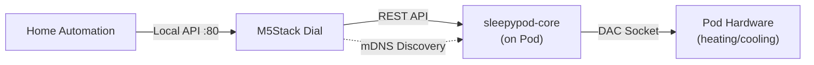
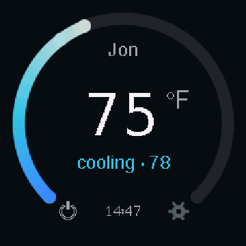
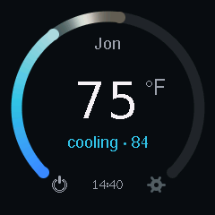
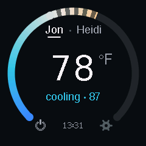
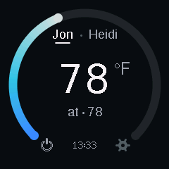
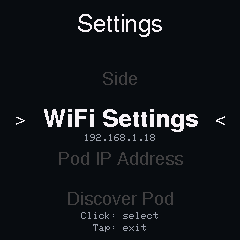

# sleepypod Dial: technical overview

The README is the product page. This is the reference for how the firmware behaves and what it talks to. See also [architecture.md](architecture.md) for boot, loop, rendering and state diagrams.

An M5Stack Dial (ESP32-S3) temperature controller for [sleepypod-core](https://github.com/sleepypod/core), providing a physical rotary interface to control your Pod's left and right side temperatures.

Based on [RotaryDial by dallonby](https://github.com/dallonby/RotaryDial) — the original FreeSleep rotary dial controller. This project adapts the concept to use sleepypod-core's tRPC/REST APIs, mDNS auto-discovery, and side-name personalization.

## How It Works



The dial communicates with sleepypod-core over your local network — no cloud, no internet required. It discovers the Pod automatically via mDNS (`_sleepypod._tcp`) or uses a manually configured IP.

## Features

### Temperature Control
- **Your side is a preference**: Settings > Side picks Left or Right and sticks; nothing on the main screen switches it by accident
- **Rotary Dial Interface**: 1°F per detent, 2°F per detent when you spin it, never more
- **Power**: Click the dial or tap the power glyph. Two detents below 55°F also turn the side off; any detent up turns it back on
- **Temperature Range**: 55°F to 110°F (matching Pod hardware limits)
- **Visual Temperature Arc**: 270° gradient from cold-water blue through a body-neutral white to red-orange
- **One timeline**: Solid fill is the mattress temperature; the span up to the target sits dimmer with a soft highlight that travels toward the target, so you can see the bed is on its way

### sleepypod-core Integration
- **mDNS Auto-Discovery**: Finds your Pod on the network automatically
- **Personalized Side Names**: Fetches side names from sleepypod-core settings
- **Real-Time Sync**: Polls Pod status every 30 seconds for external changes (backs off when the Pod is unreachable)
- **Debounced, non-blocking updates**: Changes are sent 500ms after the dial stops, from a worker task, so a slow Pod never stalls the dial
- **Unconfirmed writes are visible**: The arc's end cap is hollow until the Pod acknowledges a change
- **Local changes win**: Background polling waits 30 seconds after interaction; a completed write refreshes ownership and the effective target immediately, without overwriting newer queued input
- **Connection Status**: "No Wi-Fi" / "Pod offline" on the main screen when degraded
- **Auto-Reconnect**: Recovers WiFi automatically after router restarts
- **Auto-Restart**: Configurable daily restart for reliability

### Manual holds and Resume

A user adjustment creates a per-side manual hold in core. **Settings > Hold duration** cycles 15, 30, 60, and 120 minutes (default 30), saved on the dial for future adjustments. Changing this preference alone does not send a command or renew an existing hold.

The main screen shows Manual hold, Run once, Autopilot, Schedule, or No owner below the mattress temperature. Manual holds show their expiry in the dial's configured local time when its clock is initialized; otherwise they show "Manual hold". Safety/off blocks are displayed alongside ownership. The large number remains the effective hardware target, not a blocked controller's proposed target.

**Settings > Resume** releases the active side's hold through `POST /api/device/temperature/resume` with `{"side":"left"}` (or right). Core decides the currently applicable automation; Resume does not itself power a side on. Resume cancels that side's queued temperature/power commands, and waits behind any request already in flight. A later turn or power command supersedes a queued Resume. Shutdown cancels a queued temperature change.

Temperature writes retain the 500ms debounce. The worker reads status immediately after writes/Resume so the display reflects core's result. Each side shows "Updating..." while its request is in flight and "Update failed" if its write or confirming status read fails. Input and failures on the other side do not change that indication. Known safety/off blocks remain visible alongside progress and errors. Polling never resends a target or renews a hold. Core owns expiry even when the dial disconnects.

Compatibility is detected per side through `temperatureControl.left/right` in `GET /api/device/status`. Until that object is present, the dial omits `holdMinutes`, leaves the ownership line empty, and marks Resume unavailable. The duration preference remains saved for when core supports it. This covers older strict-validation APIs and controller startup. Hold expiry is parsed as a 64-bit Unix millisecond timestamp. See the [core consumer API contract](https://github.com/sleepypod/core/blob/97df464d2714fff6b0d3bd273b501ca527c79fb7/docs/temperature-control.md).

The capability object is compatibility information, not authorization. Core validates side and hold-duration inputs and enforces its safety/off checks independently. In the [merged device router](https://github.com/sleepypod/core/blob/97df464d2714fff6b0d3bd273b501ca527c79fb7/src/server/routers/device.ts), these are unprotected local-network procedures (`publicProcedure`, `protect: false`); this firmware does not add authentication. Resume reconciles through the [controller's safety and power gates](https://github.com/sleepypod/core/blob/97df464d2714fff6b0d3bd273b501ca527c79fb7/src/temperature/controller.ts).

### Automatic Night Mode
- **Automatic Activation**: Red-only theme between 10pm and 7am (configurable)
- **Reduced Brightness**: 20% during night hours
- **Manual Override**: Settings offers Auto / Forced On / Forced Off
- **Silent at night**: No sounds at all while the night theme is active; day-time feedback is a single 10ms tick

### Smart Display
- **Auto Dimming**: ~1% brightness after 10 seconds of inactivity (5 seconds at night), with fades instead of steps
- **Glanceable when dim**: Only the big numeral and one status dot survive at 1% backlight, by design
- **Safe Wake**: Input more than 3 seconds after dimming only wakes the screen — it never changes anything
- **Motion**: The arc settles after you stop turning, the side underline slides, nothing else animates

### Local REST API (planned, not yet implemented)
The intent is for the dial to expose its own API on port 80 for home automation. The current firmware does not start a web server; this section documents the planned surface:

| Endpoint | Method | Description |
|----------|--------|-------------|
| `/` | GET | HTML dashboard |
| `/api/temperature` | GET/POST | Current setpoint, set temperature |
| `/api/status` | GET | Full device status |
| `/api/config/pod-ip` | GET/POST | Pod IP configuration |

## Screens

Captured from the device with `tools/walkthrough.py`, which also records
short clips of the animations into `video/` and rebuilds the README banner.
The [full walkthrough and setup guides](https://sleepypod.github.io/dial/) live in the unified docs.
`docs/index.html` is a permanent redirect; the capture tool does not overwrite it.

   

| Heating | Cooling | At target | Off |
|---|---|---|---|
|  |  |  |  |

| Hold for settings | Settings | Night | Dim (night / day) |
|---|---|---|---|
|  |  |  |   |

## Usage

### Main Screen

```
        ┌───────────────────┐
       ╱        Jon           ╲      ← your side's name (Settings > Side)
      │                       │
      │        82 °F          │      ← setpoint (DejaVu 56)
      │                       │
      │     heating · 69      │      ← mattress temperature and direction
       ╲                     ╱
        ╲  ⏻    12:26    ⚙ ╱        ← power and settings glyphs flank the clock
         └─────────────────┘
```

The 270° arc opens at the bottom and is one temperature timeline: solid
fill up to the mattress temperature, then a dimmer span up to the target
with a soft highlight that travels toward it and shrinks as the bed
converges. The cap sits at the target. Only your side's name is shown; the
side itself is chosen in Settings. When Wi-Fi is down the clock
is replaced by "No Wi-Fi" and the arc turns grey; when the Pod is
unreachable the status line says "Pod offline" and the arc's end cap is
drawn hollow, the same cue used while a change is still unacknowledged.

### Controls

Nothing on the main screen changes a value by touch. The only touch targets
are the power and gear glyphs beside the clock; the hold shows a progress ring.

| Action | Result |
|--------|--------|
| **Rotate** | Adjust the active side's setpoint (1°F per detent; 2°F when spun) |
| **Click the dial** or **tap the power glyph** | Toggle the side's power |
| **Rotate 2 detents below 55°F** | Also turns the side off (the OFF stop); any detent up turns it back on |
| **Hold the dial or screen 1.5s** or **tap the gear** | Open settings; a ring fills around the rim, release early to cancel |
| **Settings > Side** | Choose Left or Right; it switches immediately and is remembered |
| **Settings > Hold duration** | Cycle 15 / 30 / 60 / 120 minutes for future adjustments |
| **Settings > Resume** | Release the active side's manual hold and refresh its effective target |
| **Any input while dimmed** | Wakes the screen only (after the 3-second safe-wake arming) |

